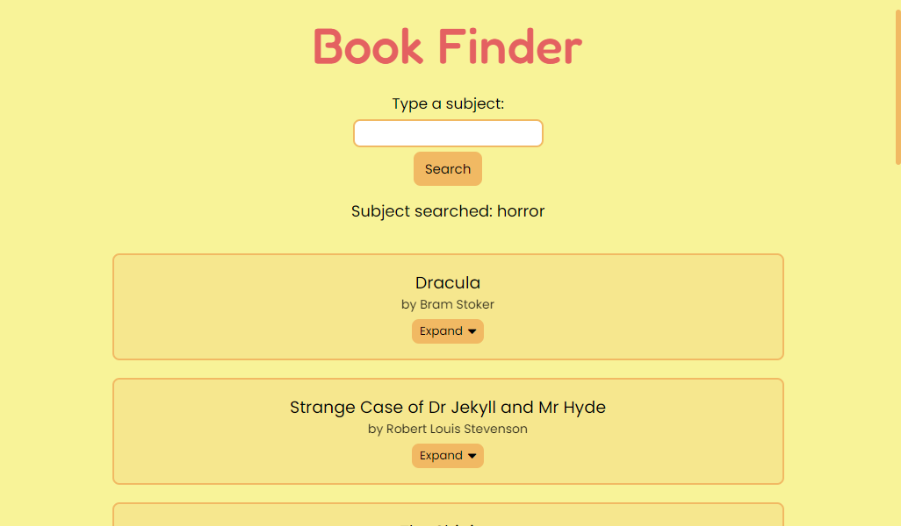

# Book Finder

This is the final project from the JavaScript Advanced course on the online course provider [Start2Impact](https://www.start2impact.it/), where I'm studying front-end development.

## Link

- [Project url](https://finderforbooks.netlify.app/) (hosted on Netlify)

## Screenshots

## Project

Users should be able to:

- Type a subject in the search field and see a list of books related to that subject with their titles and authors
- Click or tap on the expand button to expand the book element and see the cover and description of the book

The website uses the Open Library API and Axios to fetch the data.  
I used Webpack to bundle the files.

## Built with

- Semantic HTML5 markup
- CSS custom properties and media queries
- JavaScript
- Sass
- Axios
- Lodash
- Webpack

## Author

Chiara Stefanelli - Front-End Development Student based in Italy

- Website - [Chiara Stefanelli](https://chiarastefanelli.netlify.app/)
- LinkedIn - [Chiara Stefanelli](https://www.linkedin.com/in/chiarastefanelli/?locale=en_US)
- start2impact profile - [Chiara Stefanelli](https://talent.start2impact.it/profile/chiara-stefanelli-13)
